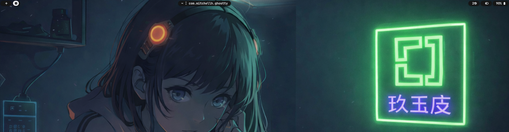
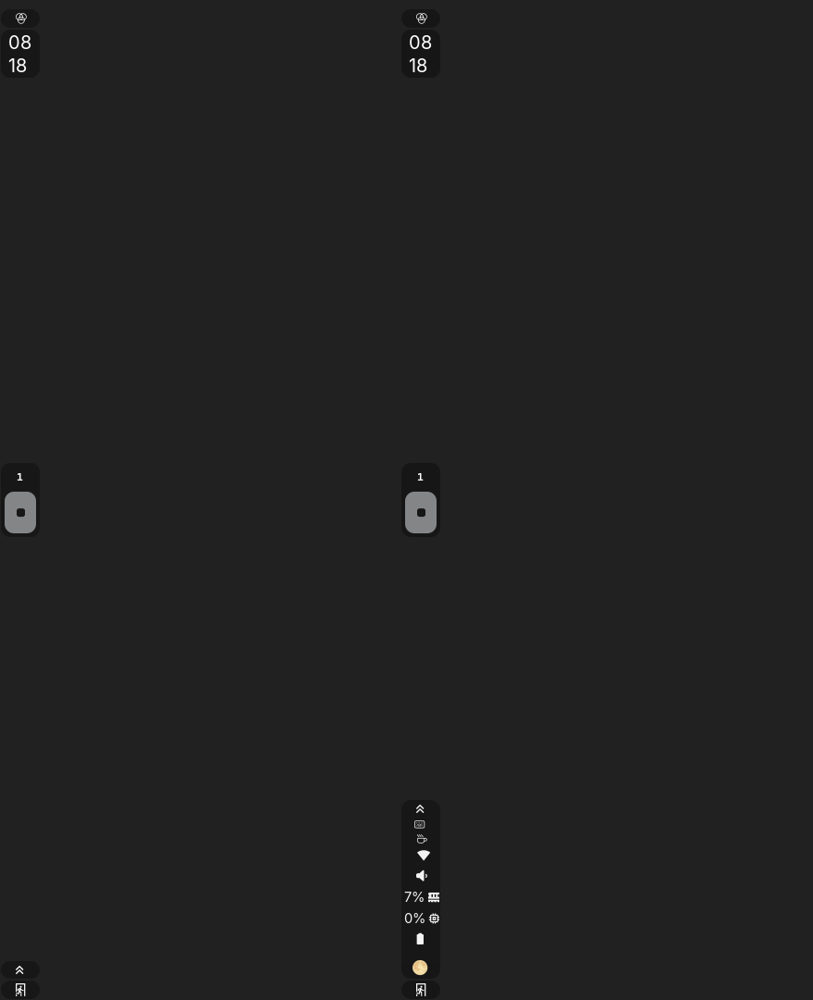
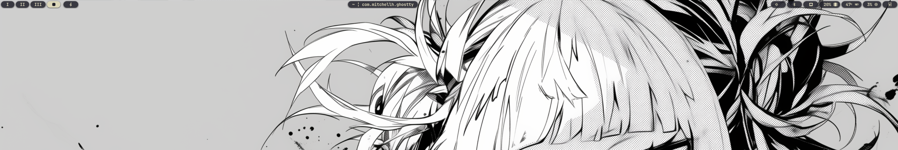

# My Custom Waybars


Requirements for the Bars to work:  
```yay -S waybar-module-pacman-updates-git```  
```yay -S wttrbar```  


**Island**:  
Quick Remake of one posted in the #Omarchy-Themes Discord  
  
  
  
  
**Boxxy [Colored]**  
Remaster of one of [HANCORE's](https://github.com/HANCORE-linux) waybar.. colored the icons to the color closet to the device.. changed the icon to Arch logo and added a power button that goes to the Omarchy Power Menu.. On the note of the GPU temp in this version it only works with NVidia Cards.  
  
  
  
  
**Pillz [Colored & Transparent]**  
Remaster of [HANCORE's](https://github.com/HANCORE-linux) expandable right hand side. colored icons, changed some icons, removed workspace numbers and changed main icon to Arch Logo.  
  
  
  
  
**Pillz [Colored & Blk]**  
Remaster of [HANCORE's](https://github.com/HANCORE-linux) expandable right hand side. colored icons, changed some icons, removed workspace numbers and changed main icon to Arch Logo.  
  
  
  
  
  **Minimal**:  
Minimalistic Waybar only showing the bare minimum to still be useful.  
  
  
  
    
**Minimal (Vertical)**  
Minimalist Vertical waybar with all the icons hiding behind the expanded tray to show as little as possible. Based off [Adsovetzky's](https://github.com/adsovetzky/Adsovetzky-Omarchy-s-Waybar/tree/main) v1.5  
  
  
    
 **Minimal v2**  
Minimalist waybar only showing workspaces, current window, a single icon for currently playing media, and the sys stats and a power menu  

